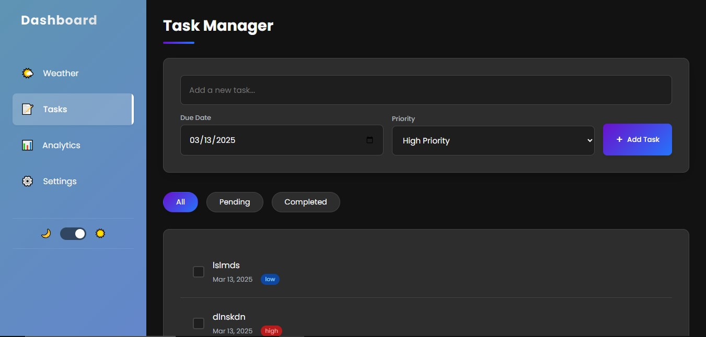

# Weather & Task Manager App

🌐 Live Demo
🔗 Live Demo (https://weather-app-sumit1003s-projects.vercel.app/)

## Overview
The Weather & Task Manager App is a web-based application that allows users to check real-time weather updates and manage their daily tasks efficiently. The app integrates OpenWeatherMap API for weather data and provides a simple task management system.

## Features
- **Real-time Weather Data**: Get current temperature, humidity, wind speed, and a 5-day forecast.
- **Search Functionality**: Users can search for any city to get weather updates.
- **Dark Mode Support**: Toggle between light and dark themes.
- **Task Management**: Add, edit, and remove tasks with priorities and due dates.
- **Weather Icons**: Dynamic icons representing weather conditions.
- **Temperature Unit Toggle**: Switch between Celsius and Fahrenheit.
- **Mobile Responsive**: Fully optimized for mobile and desktop users.
- **Interactive UI**: Smooth animations and transitions for a better user experience.

## Installation
### Prerequisites
Ensure you have the following installed:
- A modern web browser
- Internet connection (to fetch weather data)

### Steps
1. Clone the repository:
   ```sh
   git clone https://github.com/your-username/weather-task-manager.git
   ```
2. Navigate to the project directory:
   ```sh
   cd weather-task-manager
   ```
3. Open `index.html` in your browser.

## Usage
1. Enter a city name and click the search button to get the weather details.
2. Add tasks by entering a description, selecting a date, and setting a priority.
3. Use the filter buttons to organize tasks by priority.
4. Toggle between light and dark modes using the theme switch.
5. Switch temperature units by clicking on the unit toggle buttons.

## API Configuration
The app uses OpenWeatherMap API. To use it, replace `API_KEY` in the JavaScript file with your own key:
```js
const API_KEY = 'your-api-key-here';
```

## Technologies Used
- **HTML**: Structure of the app
- **CSS**: Styling and animations
- **JavaScript**: Functionality and API integration
- **OpenWeatherMap API**: Fetching weather data

## Future Enhancements
- **Local Storage Integration**: Save tasks even after page reloads.
- **Notifications**: Reminders for pending tasks.
- **Multiple City Support**: Compare weather for multiple cities.
- **Custom Themes**: Allow users to select different themes.

## License
This project is licensed under the MIT License. See `LICENSE` for details.

## Contributors
- Sumit - [Sumit1003 · Sumit](https://github.com/Sumit1003)

## Feedback
If you have any suggestions or find any bugs, please open an issue on [GitHub](https://github.com/Sumit1003/weather-task-manager/issues).

## Screenshots

### Home Page in day mode


### Task Manager in dark mode


### Login Page

